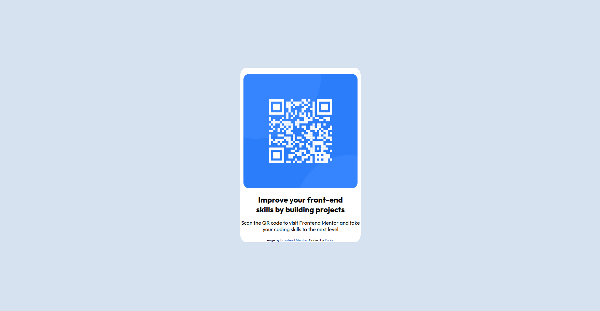

# Frontend Mentor - QR code component solution

This is a solution to the [QR code component challenge on Frontend Mentor](https://www.frontendmentor.io/challenges/qr-code-component-iux_sIO_H). Frontend Mentor challenges help you improve your coding skills by building realistic projects.

## Table of contents

- [Overview](#overview)
    - [Screenshot](#screenshot)
    - [Links](#links)
- [My process](#my-process)
    - [Built with](#built-with)
    - [What I learned](#what-i-learned)

## Overview

### Screenshot

### Links

- Solution URL: [Add solution URL here](https://github.com/Dirky14/frontendmentor-qrcode)
- Live Site URL: [Add live site URL here](https://effervescent-cupcake-578476.netlify.app/)

## My process
I made this site with pure CSS and HTML, with some div elements and some CSS rules.
### Built with

- Semantic HTML5 markup
- CSS custom properties
- Flexbox
- CSS Grid

### What I learned
In this project, I relearn how to make a simple responsive site with HTML and CSS.
### Continued development

I will look particulary at the responsive design of a CSS website.